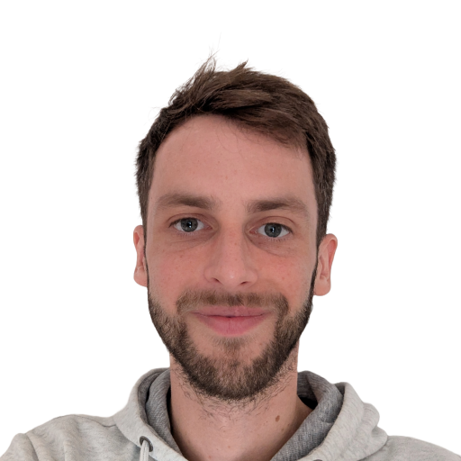
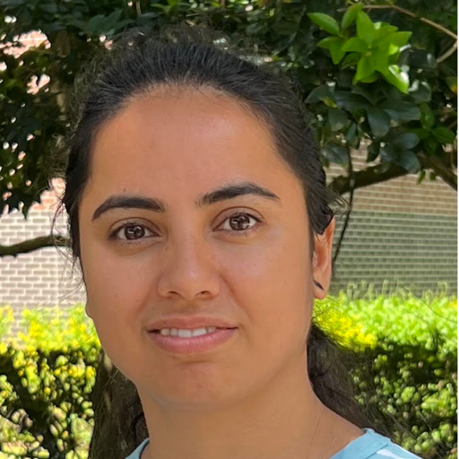

<h1>Organization</h1>

    
    

        <h2 class="profile-name">Kevin Wilkinghoff</h2>
        
Postdoctoral Researcher, Aalborg University

        

            
            
            
        

    

    
    

        <h2 class="profile-name">Neelu Madan</h2>
        
Postdoctoral Researcher, Aalborg University

        

            
            
            
            
        

    

    
    

        <h2 class="profile-name">J. Miguel Valverde</h2>
        
Postdoctoral Researcher, DTU Compute

        

            
            
            
            
        

    

