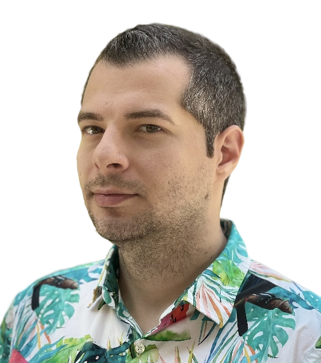
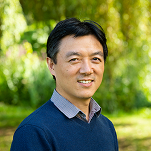
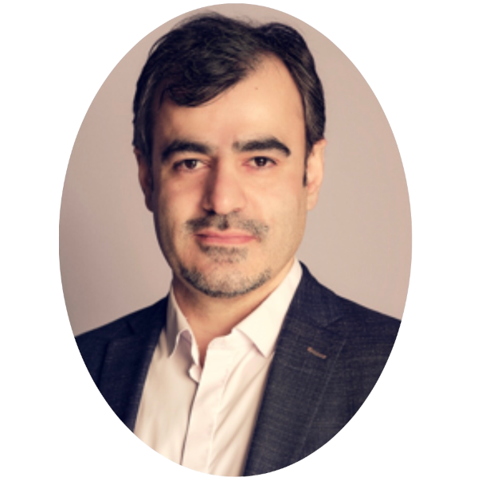

<h1>Speakers</h1>

    
    

        <h2 class="profile-name">Radu Ionescu </h2>
        
Professor, University of Bucharest (Romania)

        
Scalable real-time abnormal event detection

        

State-of-the-art video anomaly detectors typically rely on a costly object detection method to increase precision, limiting the processing bandwidth to one video stream per GPU, at around 20-30 FPS. However, for real-world video surveillance, e.g. monitoring an entire city with hundreds or thousands of cameras, the processing costs of object-centric video anomaly detectors are simply too high, given their power consumption and the cost of GPUs. To this end, we will present two lightweight models, capable of processing over 60 video streams at 25 FPS, significantly reducing the processing costs. Different from competing models performing anomaly detection at the object or spatio-temporal cube levels, we present models that take whole video frames as input, which is significantly more efficient. The presented models employ several techniques to achieve efficiency, e.g. adversarial knowledge distillation, self-distillation and masked auto-encoders. Comprehensive experiments on four benchmarks show that the presented methods are significantly faster than state-of-the-art methods, while achieving comparable accuracy levels.
        

    

    
    

        <h2 class="profile-name">Wenwu Wang </h2>
        
Professor, University of Surrey (United Kingdom)

        
Anomalous Sound Detection

        

Anomalous Sound Detection (ASD) is a vital research field aimed at identifying abnormal or unexpected sounds in acoustic environments, often without prior knowledge of the anomalies themselves. It has broad applications in areas such as industrial monitoring, surveillance, healthcare, and environmental sensing, where early detection of unusual sounds can indicate equipment malfunctions, safety risks, or other critical events. ASD systems typically learn the characteristics of normal acoustic patterns and detect deviations from these patterns using signal processing and machine learning methods. In this talk, we will explore recent advances in anomalous sound detection, highlighting key challenges, emerging techniques, and future research opportunities. We will also present our latest work on contrastive, self-supervised, and statistical approaches designed to enhance robustness, domain generalization, and anomaly sensitivity across noisy, domain-shifted, and machine-specific industrial datasets.
        

    

    
    

        <h2 class="profile-name">Line Katrine Harder Clemmensen</h2>
        
Professor, University of Copenhagen, Dept. of Mathematical Sciences (Denmark)

        
Anomaly detection and self-explainability of vessel behavior based on AIS data

        

        This talk discusses anomaly detection of maritime traffic with a focus on two case studies: A cable breach in Svalbard and a search and rescue event near Bornholm. We propose a variational autoeencoder approach with self-explainability to understand the normal maritime behaviors, and study trransferability of the learned architecture between regions.
        

    

    
    

        <h2 class="profile-name">Zheng-Hua Tan </h2>
        
Professor, Aalborg University (Denmark)

        
Detecting adversarial audio in deep speech systems

        

        Deep learning-based speech recognition systems are increasingly deployed in real-world applications, yet they are vulnerable to adversarial attacks, subtle perturbations that mislead models while remaining imperceptible to humans. These attacks compromise user privacy, security, and safety. This talk presents strategies for detecting and defending against adversarial audio in speech systems. We begin by formulating adversarial detection as a classification task by training models on systematically generated datasets of white-box and black-box attacks. We then enhance detection performance by leveraging domain-specific features. Finally, we introduce a training-free approach based on pre-trained diffusion models, which purify adversarial inputs and enable accurate detection. Our findings show that combining supervised learning, feature engineering, and generative models provides robust defenses against adversarial attacks. We hope that these approaches offer a different perspective beyond traditional anomaly detection methods and inspire discussion and adoption of similar methodologies in other tasks.
        

    

    
    

        <h2 class="profile-name">Kamal Nasrollahi</h2>
        
Director of Research, Milestones System. Professor, Aalborg University (Denmark)

        
Privacy preserving video surveillance and detecting anomalies where it matters most

        

        The "Harborfront Dataset" contains real-world data collected from the harbor region in the city of Aalborg. The "Long-Term Drift Dataset", proposed by our team at Aalborg University, is designed to study drift in thermal video analysis tasks, i.e., object detection and long-term scene change detection as conditions shift from day to night and across seasons. By capturing only infrared signatures, the dataset preserves human privacy while still providing critical information about activity near the harbor. This makes it highly valuable for detecting potentially life-threatening events, such as drowning or accidental falls into the water. In this context, anomalies are truly high-stakes, where timely detection can save lives. This talk will introduce the Harborfront Dataset and highlight real-world use cases demonstrating the importance of robust anomaly detection in safety-critical environments.
        

    

