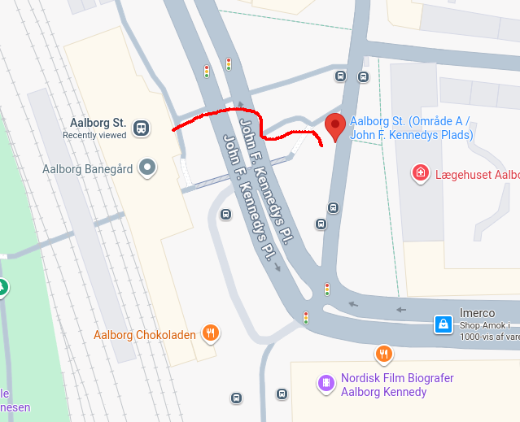
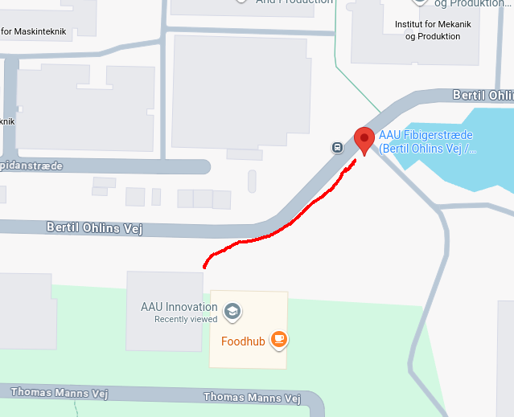

MMAD workshop will take place at AAU Innovation in Aalborg (<a href="https://maps.app.goo.gl/x2AACAbwYQsK4Lqi9" target="_blank">Thomas Manns Vej 25, 9220 Aalborg Øst</a>).

<h3>How to get there?</h3>

<h4>From the airport ✈️</h4>
Buses 13, 70, 71, 200, and train 69 regularly go to the main train station.

<h4>From the train station 🚆</h4>
Take the bus 2 towards "Universitetet", and stop in "AAU Fibigerstræde (Bertil Ohlins Vej / Aalborg)".
The frequency of this bus in the morning is every 10 minutes.

